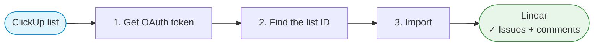

# ClickUp → Linear Migration

Scripts for importing ClickUp tasks into Linear, with comments, metadata and original timestamps preserved.

## Prerequisites

- `curl` for HTTP requests
- `jq` for JSON parsing
- `CLICKUP_API_KEY` (get it from https://app.clickup.com/settings/apps)
- `LINEAR_OAUTH_TOKEN` — see below

### Why OAuth instead of a Linear API key

Linear only allows `createAsUser` / `displayIconUrl` for OAuth applications authorized with `actor=app`. Those two fields are what let imported issues and comments show the **original ClickUp author's name and avatar** instead of everything appearing under whoever ran the script.

Set the application up once:

1. Create an OAuth application at https://linear.app/settings/api/applications/new
   - The application **name is what appears in "(via …)"** on every imported issue and comment — "ClickUp Import" reads well.
   - Redirect callback URL: `http://localhost:8080/callback`
   - No Linear review is needed to use it in your own workspace, but installing it may require workspace admin rights.
2. Note the `client_id` and `client_secret`, then run `./get-linear-token.sh` (see below).

## Migration Workflow



**1. Get an OAuth token**

```bash
export LINEAR_CLIENT_ID=...
export LINEAR_CLIENT_SECRET=...
./get-linear-token.sh
# follow the printed URL, paste the code back, then export the token it prints
```

**2. Find the list you want to import**

```bash
export CLICKUP_API_KEY=pk_...
./get-clickup-lists.sh
```

**3. Import it**

```bash
./import-to-linear.sh ENG 901234567890
```

## Tools

#### `get-linear-token.sh`

**Purpose**: Exchange an OAuth authorization code for a Linear access token with `actor=app`, which is what enables author attribution on imported issues and comments.

**Motivation**: The token cannot be copied from Linear's settings the way a personal API key can — it has to come out of the OAuth flow.

Usage:

```bash
./get-linear-token.sh <client-id> <client-secret>
# or with LINEAR_CLIENT_ID / LINEAR_CLIENT_SECRET set:
./get-linear-token.sh
```

The browser redirect to `http://localhost:8080/callback` will fail to load — that is expected. Copy the `code` parameter out of the address bar and paste it back into the script.

**Note**: Tokens are valid for 24 hours. Re-run the script when the import reports an expired token.

#### `get-clickup-lists.sh`

**Purpose**: List every ClickUp list the token can see, with its ID, so you know what to import.

Usage:

```bash
./get-clickup-lists.sh
```

Output is one tab-separated line per list, so it pipes and greps cleanly:

```
901234567890	Acme / Engineering / Backend / Sprint 42 (37 tasks)
901234567891	Acme / Engineering / Bugs (12 tasks)
```

**Note**: Requires `CLICKUP_API_KEY`.

#### `import-to-linear.sh`

**Purpose**: Import every task from one or more ClickUp lists into a Linear team, with comments and metadata.

Usage:

```bash
./import-to-linear.sh <linear-team-key-or-id> <clickup-list-ids> [--open-only]

./import-to-linear.sh ENG 901234567890
./import-to-linear.sh ENG 901234567890,901234567891
./import-to-linear.sh ENG 901234567890 --open-only
```

**Note**: Requires `CLICKUP_API_KEY` and `LINEAR_OAUTH_TOKEN`.

By default everything in the list is imported, including done and closed tasks. Subtasks are included too — a ClickUp subtask becomes a Linear sub-issue of the same parent.

## Common Options

| Option | Description |
|---|---|
| `--open-only` | Skip tasks whose status is `done` or `closed` |

`--open-only` is applied twice over: `include_closed=false` keeps ClickUp from returning tasks in the Closed status, and tasks whose status *type* is `done` are then filtered out locally — ClickUp returns those either way, since `include_closed` only governs the Closed status itself.

Watch out for one consequence: if an open subtask has a done parent, the parent is not imported and the subtask becomes a top-level issue. The run prints `! <task>: parent is not in the imported lists, creating without one` for each one.

## Archived tasks

Archived tasks are never imported, and archived lists, folders and spaces do not appear in `get-clickup-lists.sh`. In ClickUp, archived is distinct from closed — a closed task is one in a done-type status and *is* imported by default.

## What gets imported

| ClickUp | Linear |
|---|---|
| Task name | Title |
| Description | Description (markdown) |
| Attachments | Re-uploaded into Linear's own storage, then linked in the Links section |
| Task URL | A "ClickUp" link in the Links section |
| Created date | `Created` timestamp (the original date, not the import date) |
| Task creator | Author — shown as *"Name (via YourApp)"* with their ClickUp avatar |
| Due date | Due date (date only) |
| Priority | Priority |
| Status | Workflow state |
| Tags | Labels (created on the team if missing) |
| Assignee | Assignee, matched by email |
| Comments | Comments, with original author, avatar and timestamp |
| — | The `Migrated` label, on every imported issue |

### Priority mapping

| ClickUp | Linear |
|---|---|
| Urgent | Urgent |
| High | High |
| Normal | Medium |
| Low | Low |
| *(none)* | No priority |

### Status mapping

A ClickUp status is matched to a Linear workflow state **by name**, case-insensitively — so a ClickUp "In Progress" lands in Linear's "In Progress". Anything without a name match falls back to the ClickUp status type:

| ClickUp status type | Linear state |
|---|---|
| `open` | first `unstarted` state (usually Todo), or `backlog` |
| `custom` | first `started` state (usually In Progress) |
| `done`, `closed` | first `completed` state (usually Done) |

Every status resolved by fallback is listed at the end of the run, so you can create matching states in Linear and re-import if you want an exact match.

### Assignees

Matched against active Linear team members by email address. ClickUp supports multiple assignees per task while Linear has one, so the first assignee wins. When there is no matching Linear user the issue is left unassigned and the original name is recorded in a footer on the description; all unmatched people are listed at the end of the run.

### Attachments

Attachments are **copied into Linear**, not linked back to ClickUp: each file is downloaded, uploaded to Linear's storage via `fileUpload`, and then added to the issue's Links section. They keep working after the ClickUp workspace is shut down.

Files larger than 100 MB are skipped, as is anything that fails to download or upload. Every skipped file is listed at the end of the run and stays available in ClickUp. Raise or lower the cap with `MAX_ATTACHMENT_BYTES`:

```bash
MAX_ATTACHMENT_BYTES=$((250 * 1024 * 1024)) ./import-to-linear.sh ENG 901234567890
```

Attachments on comments are not migrated — only attachments on the task itself.

### Linking back to ClickUp

Every issue gets a "ClickUp" entry in its Links section pointing at the original task. Linear treats an attachment URL as idempotent per issue, so re-running does not stack up duplicate links, and `attachmentsForURL` can be used to find which Linear issue a given ClickUp task became.

## Caveats

- **Attribution is a display override, not a real user.** Imported issues and comments are authored by your OAuth application and rendered as *"Jane Doe (via YourApp)"*. The named person is not notified, and it does not show up in their Linear activity. They do not need a Linear account.
- **Re-running duplicates.** There is no import tracking — importing the same list twice creates every issue twice. To undo a run, filter the team by the `Migrated` label and bulk-delete.
- **The OAuth token expires after 24 hours.** Large imports that outlive it need a fresh token and a restart.
- **Due dates are date-only.** Linear stores a due date without a time; conversion is done in UTC.
- **Attachments make the import slower.** Each file costs a download from ClickUp plus an upload to Linear, so a list with many large attachments takes considerably longer than one without.
- **Not imported**: custom fields, time tracking and estimates, checklists, watchers, dependencies and linked tasks, comment attachments, and multiple assignees beyond the first.

## Rate limits

ClickUp allows roughly 100 requests/minute and Linear 2,500 requests/hour. The scripts back off and retry on HTTP 429, but a very large import can still exhaust the Linear hourly quota — if that happens, wait an hour and import the remaining lists separately.

## License

MIT
