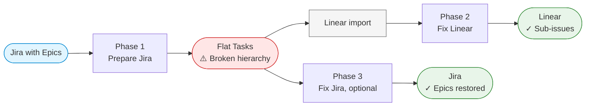

# Jira → Linear Migration

Scripts for moving Jira issues into Linear with the Epic hierarchy preserved, and for restoring that hierarchy in Jira afterwards.

Linear has no Epic issue type, so Epics are converted to Tasks before the import and the parent-child relationships are carried across as labels (`IssueTypeEpic`, `parentIs<EPIC-KEY>`). After the import the labels are used to rebuild the hierarchy — as sub-issues in Linear, and as Epics again in Jira.

## Prerequisites

- [Atlassian CLI (`acli`)](https://developer.atlassian.com/cloud/acli/installation/), authenticated with `acli jira auth login`
- `curl` and `jq`
- `JIRA_HOST` (e.g. `your-domain.atlassian.net`), `JIRA_USER_EMAIL` and `JIRA_API_TOKEN` (from https://id.atlassian.com/manage-profile/security/api-tokens) — used by the scripts that talk to the Jira REST API
- `LINEAR_API_KEY` (from https://linear.app/settings/api) — used by the Linear script

## Migration Workflow



### Phase 1 — Prepare Jira

**1. Label Bug issues** (optional but recommended)

```bash
./prepare-jira/label-bugs.sh <PROJECT-KEY> [--dry-run]
```

Adds a `Bug` label to every Bug issue, so the issue type survives as a label in Linear.

**2. Mark the Epics you want to migrate** (manual)

Add the label `IssueTypeEpic` to each Epic to include:

```bash
acli jira workitem edit --jql "project = <PROJECT-KEY> AND issuetype = Epic" --labels "IssueTypeEpic"
```

**3. Add parent relationship labels**

```bash
./prepare-jira/add-parent-labels.sh <PROJECT-KEY> [--dry-run]
```

Adds a `parentIs<EPIC-KEY>` label to every child of an Epic. This is what the later phases use to rebuild the hierarchy.

**4. Convert Epics to Tasks**

```bash
./prepare-jira/convert-epic-to-task.sh <PROJECT-KEY> [--dry-run]
```

Converts the labelled Epics to Task type so they migrate as regular issues instead of being dropped.

**5. Run the import**

Use Linear's built-in Jira import.

### Phase 2 — Fix the Linear hierarchy

**6. Link parents and children**

```bash
./fix-linear/link-parent-and-child.sh <TEAM-KEY> [--dry-run]
```

Reads the `parentIs` labels and creates the matching sub-issue relationships in Linear via the GraphQL API. Requires `LINEAR_API_KEY`.

### Phase 3 — Restore the Jira hierarchy (optional)

**7. Convert Tasks back to Epics**

```bash
./fix-jira/convert-task-to-epic.sh <PROJECT-KEY> [--dry-run]
```

Converts everything labelled `IssueTypeEpic` back to Epic type.

**8. Re-link Epics and children**

```bash
./fix-jira/link-children-to-epic.sh <PROJECT-KEY> [--dry-run]
```

Sets the parent link on each child from its `parentIs` label, using the Jira REST API. Requires `JIRA_HOST`, `JIRA_USER_EMAIL` and `JIRA_API_TOKEN`.

## Common Options

| Argument | Description |
|---|---|
| `<PROJECT-KEY>` | Jira project key (e.g. `PAT`) |
| `<TEAM-KEY>` | Linear team key (e.g. `ENG`) |
| `--dry-run` | Preview the changes without applying them |

## Customizing issue selection

Every script selects its issues with a JQL or GraphQL query defined inline, so change the query in the script when the default selection doesn't fit — to include or exclude Done issues, filter by assignee, narrow a date range, and so on.

- Jira scripts: the `--jql` argument in functions such as `get_epics_in_project()` or `get_bug_issues()`
- Linear scripts: the `query` / `mutation` definitions in functions such as `get_parent_issues()` or `get_child_issues_by_label()`
